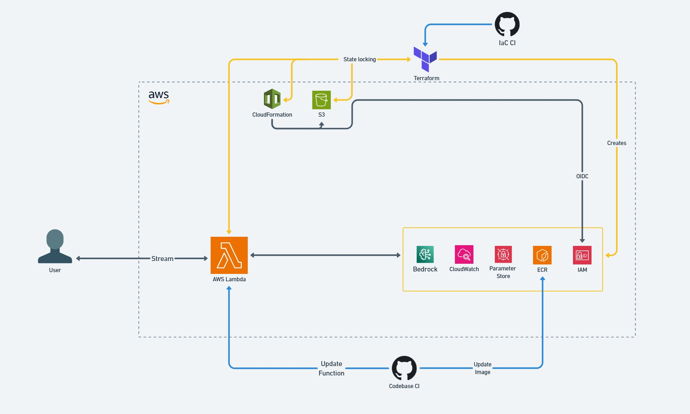

<h1 id="stock-market-agent">🤖 Stock market Agent</h1>

Project to provide a stock market AI Agent that can answer questions about the stock market, using Bedrock, Langchain, Langgraph, and monitored with LangSmith.

⚠️ If you just want to try the demo, check: <a href="./demo.ipynb"><strong>demo.ipynb</strong></a> after prerequisites.

 

<h2 id="table-of-contents">📙<strong>Table of Contents</strong></h2>
<ul>
    <li><a href="#stock-market-agent"><strong>🤖 Stock market Agent</strong></a></li>
    <li><a href="#table-of-contents">📙<strong>Table of Contents</strong></a>
        <ul>
            <li><a href="#description">🏡<strong>Description</strong></a></li>
            <li><a href="#high-level-architecture-diagram">🖼️<strong>High-Level Architecture Diagram</strong></a></li>
            <li><a href="#features">📗<strong>Features</strong></a></li>
            <li><a href="#installation">📦<strong>Installation</strong></a>
                <ul>
                    <li><a href="#prerequisites">Prerequisites</a></li>
                    <li><a href="#setup">Setup</a></li>
                </ul>
            </li>
            <li><a href="#api-documentation">📚<strong>API Documentation</strong></a>
                <ul>
                    <li><a href="#endpoint-answer">Endpoint: <code>/api/stock-agent/invoke</code></a>
                        <ul>
                            <li><a href="#request">Request</a></li>
                            <li><a href="#response">Response</a></li>
                        </ul>
                    </li>
                </ul>
            </li>
            <li><a href="#cicd-pipeline">🔄<strong>CI/CD Pipeline</strong></a>
                <ul>
                    <li><a href="#pipeline-trigger">Pipeline Trigger</a></li>
                </ul>
            </li>
            <li><a href="#running-tests">🧪<strong>Running Tests</strong></a></li>
            <li><a href="#deployment">🚀<strong>Deployment</strong></a>
                <ul>
                    <li><a href="#docker-build">Docker Build</a></li>
                    <li><a href="#docker-run">Docker Run</a></li>
                    <li><a href="#docker-push">Docker Push</a></li>
                    <li><a href="#ecs-deployment">ECS Deployment</a></li>
                </ul>
            </li>
            <li><a href="#metrics-and-logging">📊<strong>Metrics and Logging</strong></a></li>
            <li><a href="#infrastructure-components">⚒️<strong>Infrastructure Components</strong></a>
                <ul>
                    <li><a href="1-federated-identity">1. Federated Identity</a>
                        <ul>
                            <li><a href="#1-how-to-oidc">How to configure Federated Identity?</a></li>
                            <li><a href="#1-how-to-tfbackend">How to configure Terraform Backend?</a></li>
                        </ul>
                    </li>
                    <li><a href="#2-terraform">2. Terraform management</a>
                    </li>
                    <li><a href="#3-resources">3. Resources</a></li>
                    <li><a href="#terraform-docs">🏗️<strong>Terraform docs</strong></a></li>
                    <li><a href="#demo">🤖<strong>Demo</strong></a></li>
                    </li>
                </ul>
            </li>
        </ul>
    </li>
</ul>

<h2 id="description">🏡<strong>Description</strong></h2>

This repository contains a Python application that provides an AI-Agent using <strong>Anthropic Claude 3 Haiku</strong> via <strong>AWS Bedrock</strong>. The application is built with <strong>FastAPI</strong> and implements best practices, such as error handling, structured logging, and performance tracking.

The repository includes a fully automated CI/CD pipeline that ensures code quality, builds and pushes a <strong>Docker image</strong>, and deploys the application to <strong>AWS Lambda</strong>.

We can also find the infrastructure code within the path <a href="infrastructure/">infrastructure/</a> which is built using <strong>Terraform</strong> for the application resources and <strong>CloudFormation</strong> for creating federated identity and attach its roles. This code provisions the necessary resources on AWS, including the Bedrock model, Lambda function, ECR, OIDC, IAM.

  <a href="#table-of-contents">Go to Top</a>

<h2 id="high-level-architecture-diagram">🖼️ <strong>High-Level Architecture Diagram</strong></h2>

    

  <a href="#table-of-contents">Go to Top</a>

<h2 id="features">📗<strong>Features</strong></h2>
<ul>
    <li><strong>FastAPI Endpoint</strong>: A REST API endpoint to accept questions and return AI-generated answers.</li>
    <li><strong>AWS Bedrock Integration</strong>: Connects to <strong>Anthropic Claude 3 Haiku</strong> for LLM-based answers.</li>
    <li><strong>Error Handling</strong>: Robust validation and graceful handling of errors.</li>
    <li><strong>Performance Metrics</strong>: Tracks LLM response times for performance monitoring using LangSmith.</li>
    <li><strong>CI/CD Pipeline</strong>:
        <ul>
            <li>Runs tests with <code>pytest</code> and generates a coverage report.</li>
            <li>Lints and formats code using <code>pylint</code> and <code>black</code>.</li>
            <li>Builds a <code>Docker image</code> and pushes it to <code>AWS ECR</code>.</li>
            <li>Retrieves and patch dinamically environment variables from<code>AWS Parameter Store</code>.</li>
            <li>Deploys the application to <code>AWS Lambda</code></li>
        </ul>
    </li>
</ul>

<h2 id="installation">📦<strong>Installation</strong></h2>
<h3 id="prerequisites">Prerequisites</h3>
<ol>
    <li>Install <strong><a href="">Devbox</a></strong> to create isolated shells for development (recommended):</li>
        <pre><code>curl -fsSL https://get.jetify.com/devbox | bash</code></pre>
    </li>
</ol>

<h3 id="setup">Setup</h3>
<ol>
    <li>Clone the repository:
        <pre><code>git clone git@github.com:rcanelav/realtime-stock-prices.git
cd realtime-stock-prices</code></pre>
    </li>
    <li>Install development environment:
        <pre><code>devbox shell</code></pre>
    </li>
    <li>Fill the .env file with the required environment variables.
    </li>
    <li>Run the application:
        <ol>
            <li>Run local using development mode:
                <pre><code>task r</code></pre>
            </li>
            <li>Run local using Docker, creating the image and running it:
                <pre><code>task db</code></pre>
                <pre><code>task dr</code></pre>
            </li>
        </ol>
    </li>
    <li>There are more commands, if you are interested in knowing more
        <pre><code>task --list</code></pre>
    </li>
</ol>

  <a href="#table-of-contents">Go to Top</a>

<h2 id="api-documentation">📚<strong>API Documentation</strong></h2>

<h3 id="endpoint-answer">Endpoint: <code>/api/stock-agent/invoke</code></h3>

<strong>Method</strong>: <code>POST</code> 
<strong>Description</strong>: Accepts a question and returns an AI-generated answer.

<h4 id="request">Request</h4>

<strong>Payload</strong>:

<pre><code>{
  "query": "What is the stock price for Amazon right now?"
}
</code></pre>

<h4 id="response">Response</h4>

It will stream the response from the AI model with a prefix depending if its a LLM reasoning, tool calling, tool response or final answer. (It will depend on the Agent Display Config set by the user, all are enabled by default)

  <a href="#table-of-contents">Go to Top</a>

<h2 id="cicd-pipeline">🔄<strong>CI/CD Pipeline</strong></h2>

This repository includes a GitHub Actions pipeline that automates the following:

<ol>
    <li><strong>Testing</strong>: Runs <code>pytest</code> to execute the test suite and generate a coverage report.</li>
    <li><strong>Linting and Formatting</strong>: Ensures code quality using <code>pylint</code> and <code>black</code>.</li>
    <li><strong>Infrastructure as Code:</strong> executes <code>terraform</code> commant to format, validate, plan and deploy the defined resources. Creates the Federated Identity and its permissions using <code>CloudFormation</code> (For demo purposes)</li>
    <li><strong>Dockerization</strong>: Builds a Docker image and pushes it to <code>AWS Elastic Container Registry (ECR)</code>.</li>
    <li><strong>Deployment</strong>: Patches the environment variables defined in the <code>AWS Parameter store</code> and proceeds to update the <code>AWS Lambda</code> with the new image </li>
</ol>

<h3 id="pipeline-trigger">Pipeline Trigger</h3>

The pipeline runs automatically on every push to the <code>main</code> branch or executing a <code>workflow_dispatch</code>

  <a href="#table-of-contents">Go to Top</a>

<h2 id="running-tests">🧪<strong>Running Tests</strong></h2>

<ol>
    <li>To run tests:
        <pre><code>task tests</code></pre>
    </li>
</ol>

  <a href="#table-of-contents">Go to Top</a>

<h2 id="deployment">🚀<strong>Build containers</strong></h2>
<ol>
    <li>Build the Docker image:
        <pre><code>task db</code></pre>
    </li>
    <li>Run the Docker image locally:
        <pre><code>task dr</code></pre>
    </li>
    <li>Push the Docker image to AWS ECR:
        <pre><code>task dp</code></pre>
    </li>
</ol>

  <a href="#table-of-contents">Go to Top</a>

<h2 id="ecs-deployment">🚀 <strong>Deployment</strong></h2>

This repository includes an automated deployment pipeline, if you want to explore these steps:

  <ol>
    <li><a href="./.github/workflows/_deploy_images.yml#L43">🏗️Go to <strong>Containerization</strong> step</a></li>
  <li><a href="./.github/workflows/_update_lambda.yml#L31">🏗️Go to <strong>Retrieve and Merge Environment variables</strong> step</a></li>
  <li><a href="./.github/workflows/_update_lambda.yml#L98">🏗️Go to <strong>Update lambda image</strong> step</a></li>
  </ol>

  <a href="#table-of-contents">Go to Top</a>

<h2 id="metrics-and-logging">📊<strong>Metrics and Logging</strong></h2>

<ul>
    <li><strong>Structured Logs</strong>: Logs are output in JSON format for easy integration with tools like AWS CloudWatch.</li>
    <li><strong>Performance Metrics</strong>: Tracks and logs the LLM response time for performance analysis.</li>
</ul>

  <a href="#table-of-contents">Go to Top</a>

 
<h2 id="infrastructure-components">⚒️ Infrastructure Components</h2>
<h3 id="1-federated-identity">1. Federated Identity</h3>

Uses a CloudFormation template to create the OIDC identity, its policies and roles

<h4 id="1-how-to-oidc">How to manage Federated Identity?</h4>
<ul>
    <li><strong>Create OIDC</strong>:
        <pre><code>task create-oidc</code></pre>
    </li>
    <li><strong>Update OIDC when updating cloudformation template</strong>:
        <pre><code>task update-oidc</code></pre>
    </li>
</ul>
<h4 id="1-how-to-tfbackend">How to manage Terraform backend?</h4>
<ul>
    <li><strong>Create Terraform Backend</strong>:
        <pre><code>task create-backend</code></pre>
    </li>
    <li><strong>Update Terraform Backend when updating cloudformation template</strong>:
        <pre><code>task update-backend</code></pre>
    </li>
</ul>

  <a href="#table-of-contents">Go to Top</a>

 

<h3 id="2-terraform">2. Terraform State Backend</h3>

To set up and manage your Terraform project backend:

<pre><code># Create Terraform variable definitions
task tfvars

# Initialize the Terraform project
task tfi

# Format Terraform files
task tff

# Review the Terraform execution plan
task tfp

# Apply the Terraform configuration
task tfa

# Force apply
task tfa-
</code></pre>

  <a href="#table-of-contents">Go to Top</a>

 
<h3 id="3-resources">3. Resources</h3>
<ul>
    <li><strong>IAM</strong>:
        <ul>
            <li>Lambda execution role</li>
            <li>OIDC Role</li>
        </ul>
    </li>
    <li><strong>S3</strong>:
        <ul>
            <li>Manages state locking to prevent concurrent changes and ensure state consistency.</li>
        </ul>
    </li>
    <li><strong>Elastic Container Registry</strong>:
        <ul>
            <li>Stores the different image versions published in the lambda function.</li>
        </ul>
    </li>
    <li><strong>Parameter Store</strong>:
        <ul>
            <li>Contains the environment variables values to be injected in the lambda.</li>
        </ul>
    </li>
</ul>

  <a href="#table-of-contents">Go to Top</a>

<h1 id="terraform-docs">🏗️ <strong>Terraform docs</strong></h1>
<ul>
    <li><a href="infrastructure/terraform/README.md">Resources</a></li>
    <li><a href="infrastructure/terraform/modules/aws_lambda/README.md">Module/aws_lambda</a></li>
    <li><a href="infrastructure/terraform/modules/aws_ecr/README.md">Module/aws_ecr</a></li>

</ul>

  <a href="#table-of-contents">Go to Top</a>

<h1 id="demo">🤖 <strong>Demo</strong></h1>

If you just want to try it out in a demo, please acces <a href="demo.ipynb"><strong>demo.ipynb</strong></a>

  <a href="#table-of-contents">Go to Top</a>

Thanks for reading! 🚀
